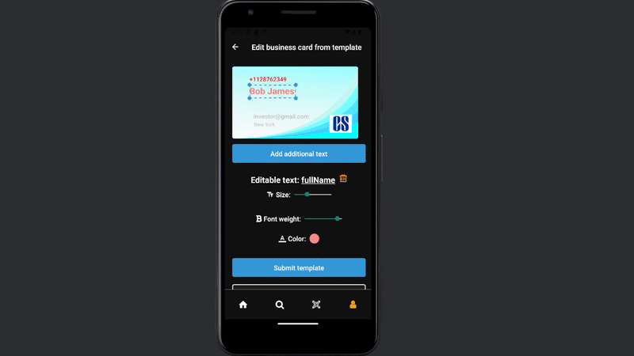
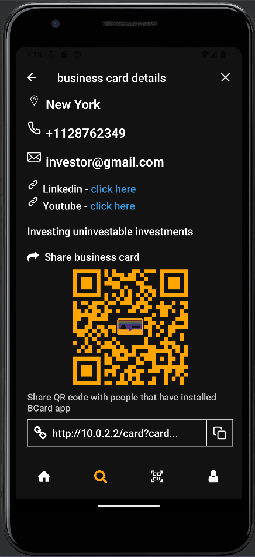
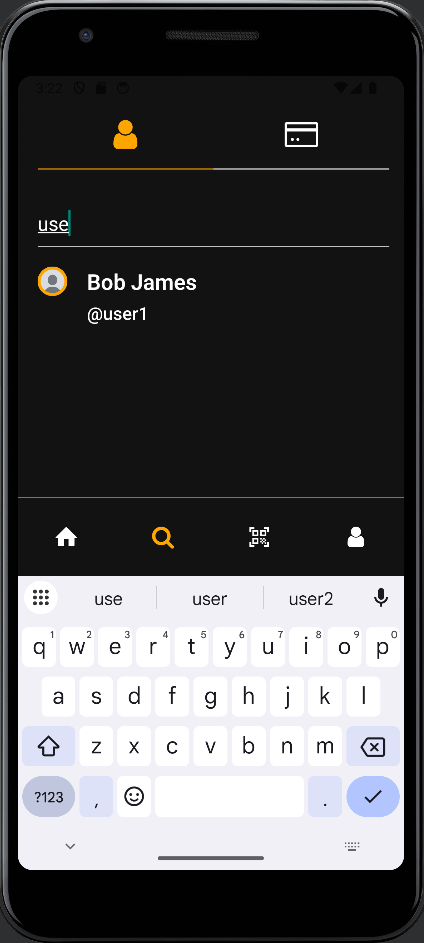
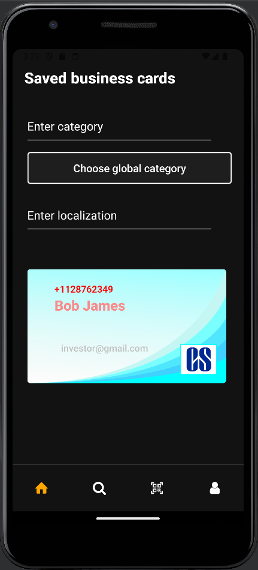
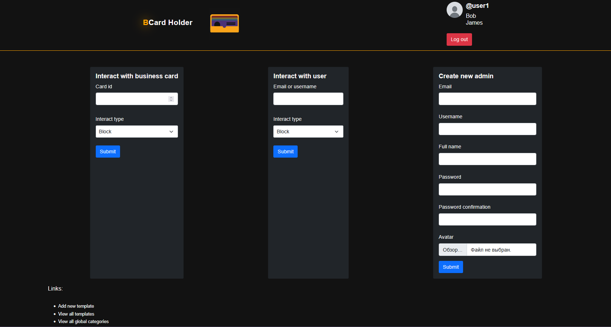
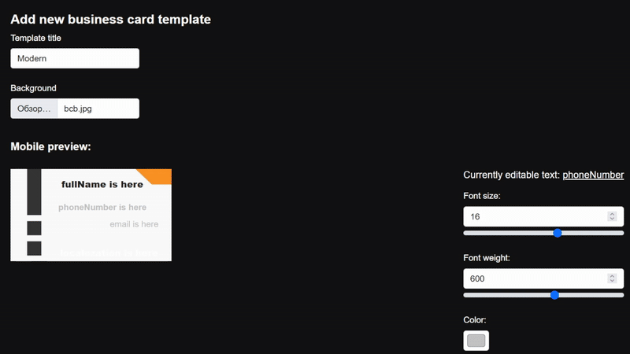
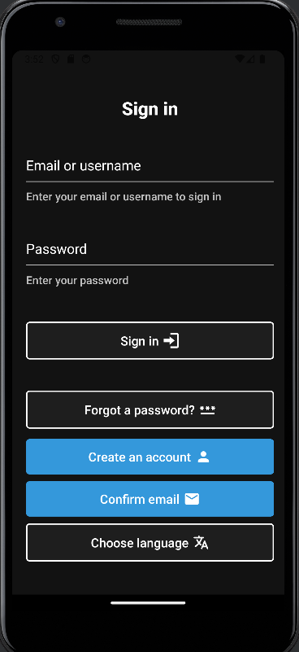
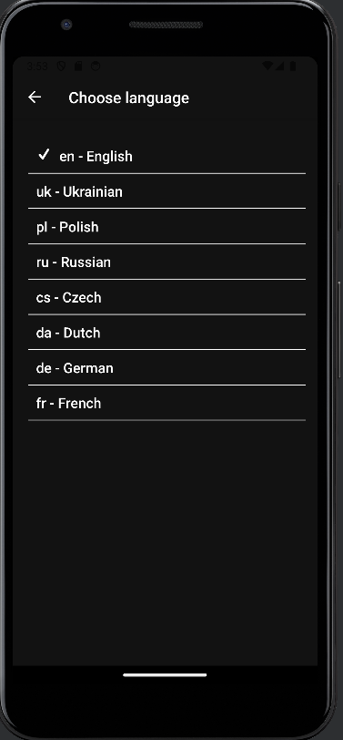

# 🪪 Business Card Holder

Create, customize, share, and manage professional digital business cards effortlessly — all in one place. Built with **React Native**, **FastAPI**, and modern DevOps tools, this project bridges mobile innovation with a powerful backend to deliver a seamless user experience.

---

## 🚀 Features

### 🌐 Web & API Backend (FastAPI)
- **Business Card Management**
  - Create cards using:
    - Uploaded image
    - Customizable templates (drag & drop elements like name, email, phone)

  - Configure privacy:
    - **Private**, **QR Code Only**, or **Public**

  - Share via **link** or **QR code** (with built-in scanner support)

- **Search & Discovery**
  - Full-text search for users

  - Search business cards by **category** and **location**



- **Admin Panel**

  - Full **CRUD for Users**
  - Create and manage card templates via drag & drop editor

  - Moderate and manage user-generated data
  - CRUD operations for card **Categories**

- **User Authentication**  
  Full authentication system with:

  - Sign up / Sign in
  - Forgot & Reset Password
  - Change Password

- **SEO Optimized** web interface for better discoverability

---

### 📱 Mobile App (React Native + Expo)
- Multi-language support (language selector)

- Create, edit, and preview business cards

- Scan and generate QR codes for sharing cards
- Explore cards and connect with professionals around the world

---

## 🧰 Tech Stack

### 🧰 Tech Stack
- **FastAPI**
- **React Native (Expo)**
- **MySQL**
- **SQLAlchemy**
- **Docker Compose**
- **NGINX**

---

## 📦 Getting Started

### 1. Set up environment variables
> Create `API/.env` file
> Fill needed variables (example: `API/.env.example`)

### 2. Start the backend
```bash
cd API
docker-compose up --build
```

### 3. Start Expo app
> If you use android emulator run the following:
```bash
adb root
adb -s <emulator id> reverse tcp:80 tcp:80
```
> It will connect device with the host machine

> Install dependencies & run app
```bash
npm install
npm run <android|ios|web>
```

### 4. Access the services
- **Mobile app**: via Expo or device emulator
- **API**: `http://localhost`
- **Admin panel**: `http://localhost/admin`
- **Frontend (optional)**: `http://localhost`
